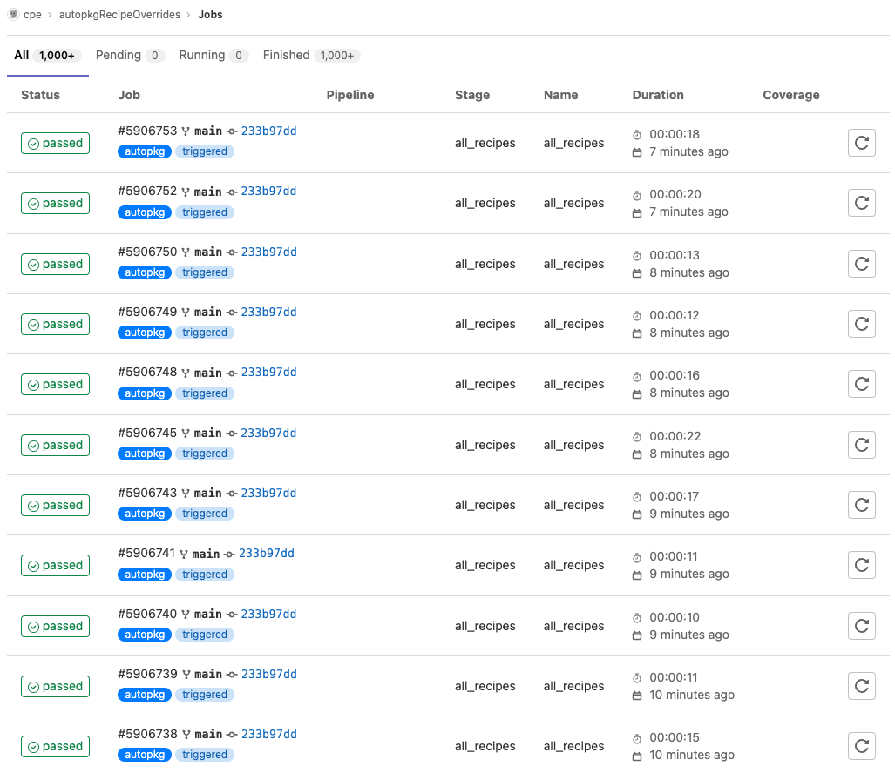
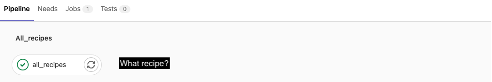
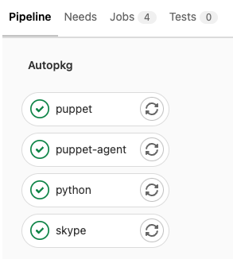
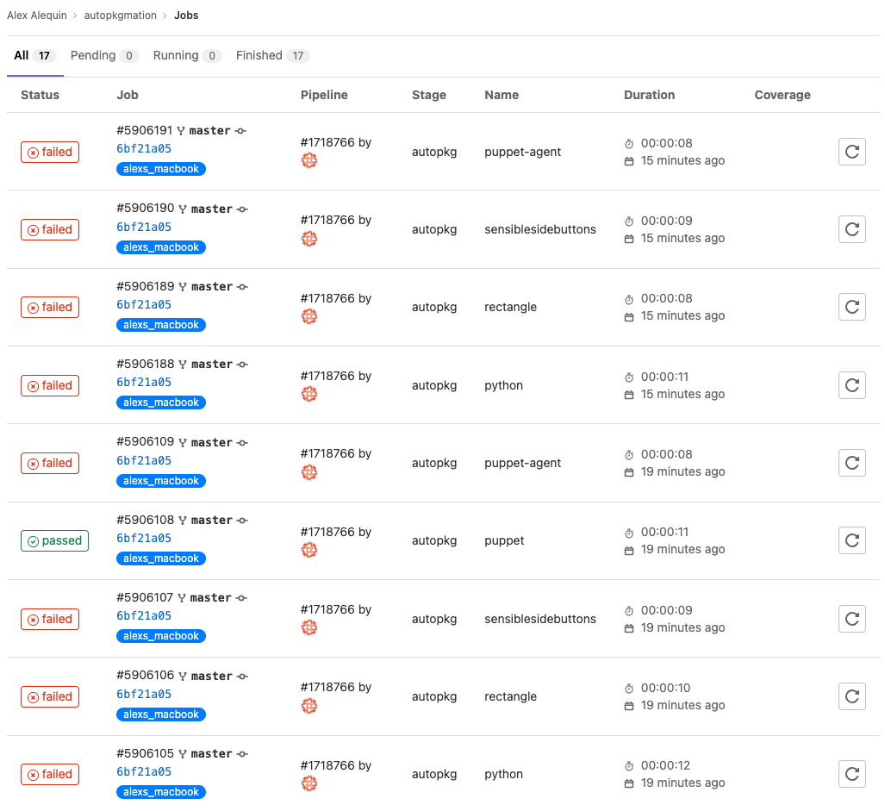
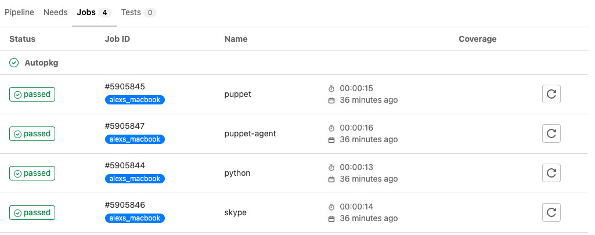
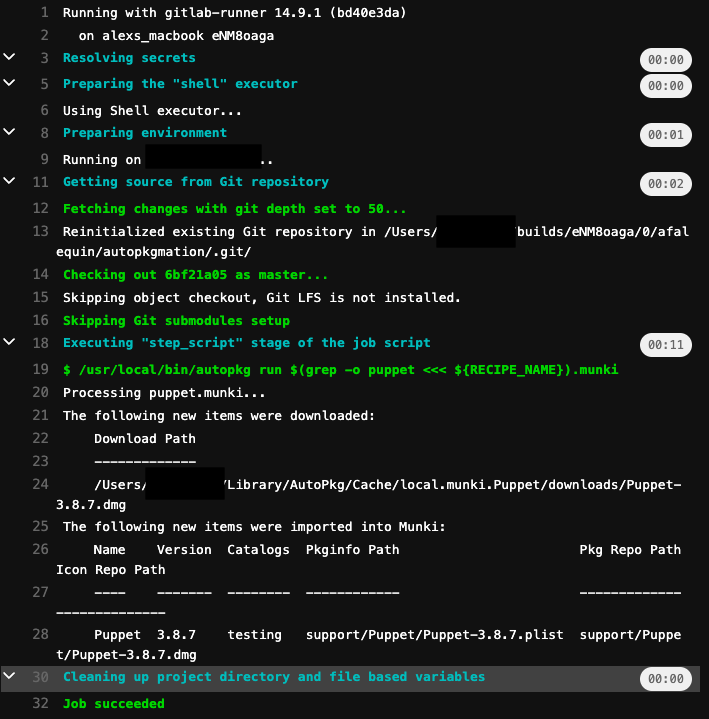

# AutoPkg Gitlab Automation Example.
This is an example of a repo hosting AutoPkg recipe overrides on Gitlab run on a schedule. `automating_da_automation.py` is what generates the complicated gitlab-ci.yml file to produce various stages that will give us a per-app job in the gitlab gui. 

# Screenshots
## Before

 
 

  

## After

 
 
 

  

`alex-gitlab.py` is a helper python script to wrap the git api into functions that we need to perform these tasks.

# Limitations

Requires a macOS runner with AutoPkg already configured on it that will remain online and act as our git runner.

I have not yet scripted the creation of the pipeline schedules although that should be fairly easy. The schedule is currently configure via the GUI and passed the variable: RECIPE_NAME with a value of SPACE-SEPARATED app names sans-extension. For example: `puppet-agent munkitools slack` will trigger the jobs for those 3 apps. This allows you to segment different apps for different schedule if you have a hunch a particular publisher releases apps on a Thursday or Tuesday.

If AutoPkg performs no tasks, the jobs continue to exist in the pipeline GUI as failed although it may have been successful, just not required. I might have to create a wrapper script around the autopkg command to parse the output and return a different exit code depending on whether the string 'Nothing downloaded, packaged, or imported' exists. I'd hopefully be able to get an 0 exit code for the job and then some logic to use the Jobs gitlab api and either trigger a job cancellation mid run or retroactively erase jobs with a specific return code. https://docs.gitlab.com/ee/api/jobs.html